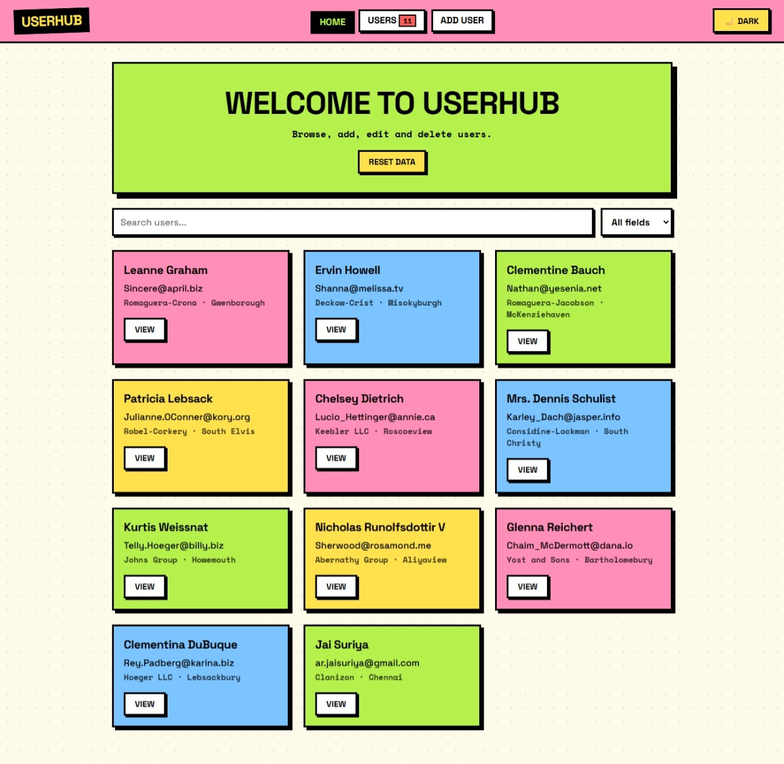

# UserHub Directory

A neo-brutalist user management dashboard built with **React**, **React Router** and **Easy Peasy**. It loads users from a free public API and supports full CRUD, debounced search, filtering, pagination, toast notifications, and a persisted dark mode.



> Add a screenshot at `screenshots/home.png`, or delete the line above.

## Features

- **Public API**: users are fetched from [JSONPlaceholder](https://jsonplaceholder.typicode.com/users)
- **Full CRUD**: get, add, edit and delete users
- **Routing**: Home, Users, User Details, Add User, Edit User and a 404 page
- **Global state**: Easy Peasy store with actions, thunks and computed values
- **Search and filter**: search by name, company or city with a 400ms debounce
- **Pagination**: page navigation with a selectable page size (5, 10, 20)
- **Toast notifications**: success and error messages on add, update and delete
- **Dark mode**: theme model with a toggle
- **Persistence**: users and theme are saved to `localStorage`
- **Neo-brutalist UI**: thick borders, hard shadows and flat bright colors, driven by CSS variables

## Tech Stack

| Tool | Purpose |
|---|---|
| React (Vite) | UI |
| React Router DOM | Routing |
| Easy Peasy | State management |
| JSONPlaceholder | Free public API |
| CSS variables | Theming |

## Routes

| Route | Page |
|---|---|
| `/` | Home with user cards, search and reset button |
| `/users` | Paginated user table with Edit and Delete |
| `/users/:id` | User details |
| `/users/add` | Add user form |
| `/users/edit/:id` | Edit user form |
| `*` | 404 Not Found |

## Getting Started

### Prerequisites

- Node.js 18 or newer
- npm

### Installation

```bash
git clone https://github.com/<your-username>/userhub.git
cd userhub
npm install
npm run dev
```

Then open the local URL shown in the terminal (usually `http://localhost:5173`).

### Build for production

```bash
npm run build
npm run preview
```

## Project Structure

```
userhub/
├── index.html
├── package.json
└── src/
    ├── main.jsx
    ├── App.jsx
    ├── index.css
    ├── hooks/
    │   └── useDebounce.js
    ├── store/
    │   ├── index.js
    │   ├── userModel.js
    │   ├── toastModel.js
    │   └── themeModel.js
    ├── components/
    │   ├── Navbar.jsx
    │   ├── ThemeToggle.jsx
    │   ├── SearchBar.jsx
    │   ├── Pagination.jsx
    │   ├── UserCard.jsx
    │   ├── UserForm.jsx
    │   ├── Loader.jsx
    │   └── ToastContainer.jsx
    └── pages/
        ├── Home.jsx
        ├── UserList.jsx
        ├── UserDetails.jsx
        ├── AddUser.jsx
        ├── EditUser.jsx
        └── NotFound.jsx
```

## How It Works

**State (Easy Peasy).** The `users` model holds the list, search term, filter, and page info. Computed values (`filteredItems`, `totalPages`, `currentPage`, `paginatedItems`) derive what the UI shows. Thunks (`fetchUsers`, `createUser`, `editUser`, `deleteUser`) handle the API calls and trigger toasts through `getStoreActions`.

**Persistence.** `persist()` saves the `users.items` list and the theme to `localStorage`. On load, `fetchUsers` skips the network call if saved data already exists, so local changes are never overwritten.

**Fake writes.** JSONPlaceholder accepts POST, PUT and DELETE but does not actually save anything. The store is therefore the source of truth after the first fetch. Users created locally get a unique id and skip the fake PUT/DELETE calls.

**Debounced search.** `useDebounce` delays updating the store until the user stops typing, so filtering runs once per pause instead of on every keystroke.

## Resetting Data

Click **Reset data** on the Home page to clear the saved users and refetch from the API. You can also run this in the browser console:

```js
localStorage.clear(); location.reload();
```

## Possible Improvements

- Column sorting on the users table
- Form validation with a library such as React Hook Form or Zod
- Unit tests for the store with Vitest
- Deploy to Vercel or Netlify

## Deployment Note

If you deploy to Netlify or Vercel, add a rewrite so client-side routes like `/users/add` don't 404 on refresh. On Netlify, create `public/_redirects` containing:

```
/*  /index.html  200
```

## License

MIT
